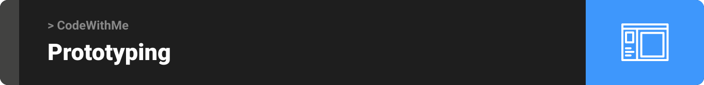
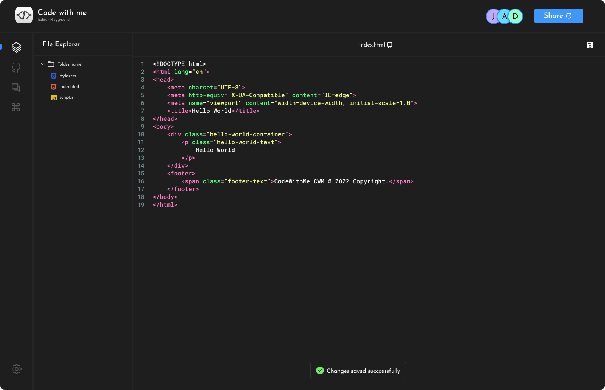
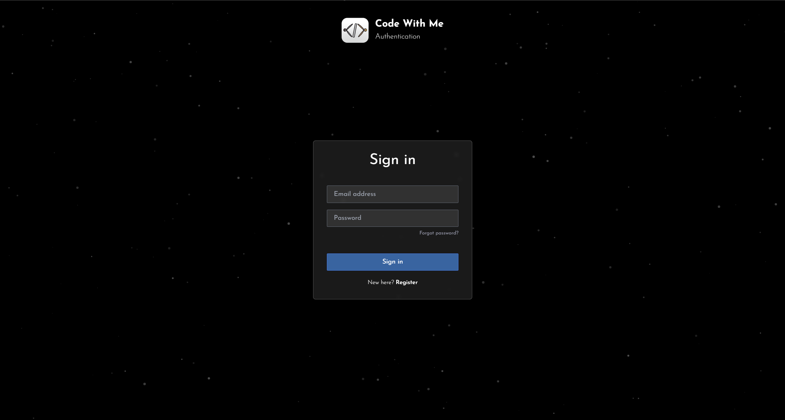
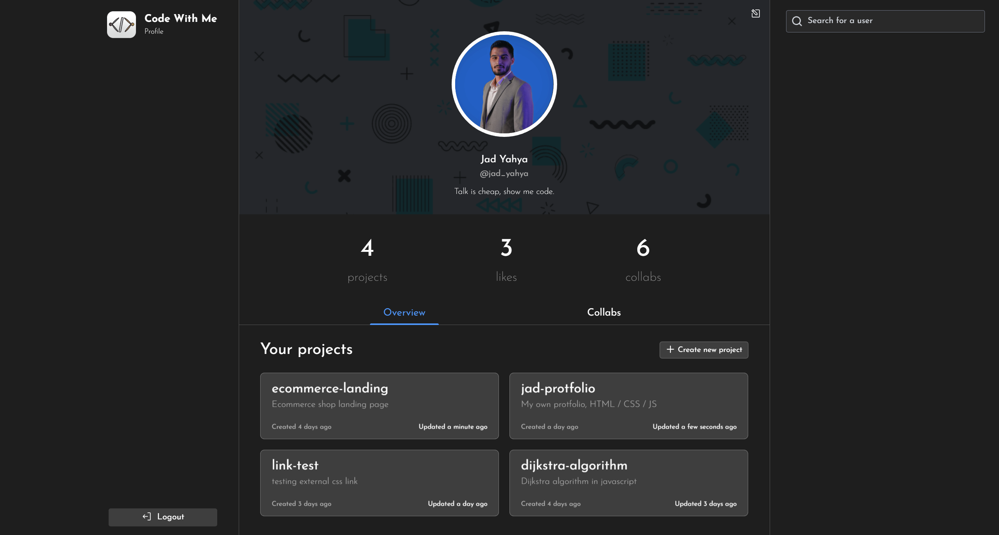
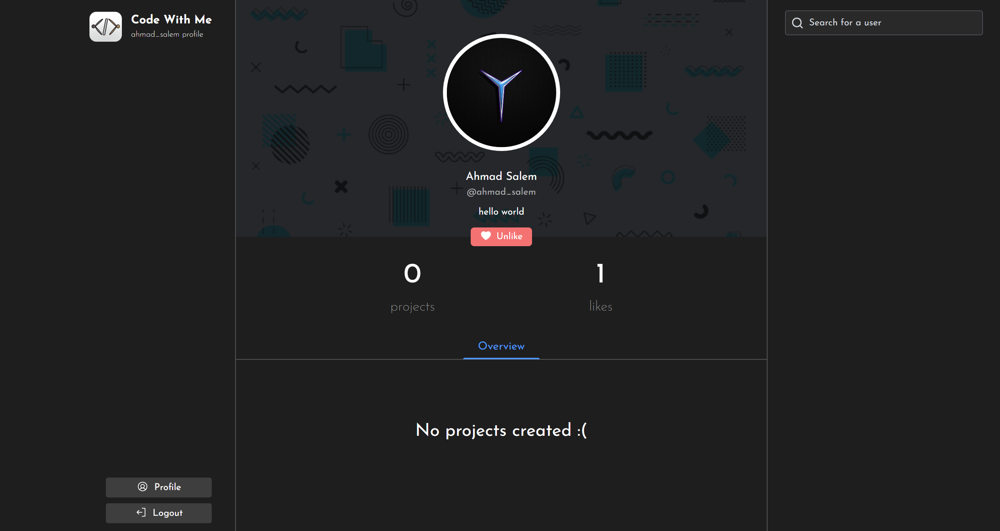

<div align="center">

> Hello world! This is the project’s summary that describes the project plain and simple, limited to the space available.

**[PROJECT PHILOSOPHY](#philosophy) • [WIREFRAMES](#prototyping) • [TECH STACK](#stack) • [IMPLEMENTATION](#implementation) • [HOW TO RUN?](#run)**

</div>
<a name="philosophy" id="philosophy"></a>


> CodeWithMe is a website to help you code togther with your friends and be more creative and productive while chatting and talking about your idea, and the steps you gonna go through.

> Not only that, when you finish coding you can save your files and projectrs online on the servers, or by pushing it directly to github!

### User Stories

- As a user, I want to code and compile my code and see result online
- As a user, I want to code online with my friends while live sharing code editor
- As a user, I want to chat with my team mates while coding together
- As a user, I want to save my code online when i finish coding
- As a user, I want to push my code to github instantly when i finish coding

<br><br>

<a name="prototyping" id="prototyping"></a>



> This design was planned before on paper, then moved to Figma app for the fine details.
> Note that i didn't use any styling library or theme, all from scratch and using pure SCSS modules and TailwindCSS

| Landing                                                                     | Login                                                                 |
| --------------------------------------------------------------------------- | --------------------------------------------------------------------- |
| [](homepage_mockup.png) | [](login_mockup.png) |

| Register                                                                | Profile                                                                   |
| ----------------------------------------------------------------------- | ------------------------------------------------------------------------- |
| [](signup_mockup.png) | [](profile_mockup.png) |

| User search results                                            | IDE                                                               |
| -------------------------------------------------------------- | ----------------------------------------------------------------- |
| [](guest.png) | [](ide_mockup.png) |

<br><br>

<a name="stack" id="stack"></a>


Here's a brief high-level overview of the tech stack the Well app uses:

## Frontend:

- This project uses the [React JS development framework](https://reactjs.org/). React is a declarative, efficient, and flexible JavaScript library for building SPA (single web application) and user interfaces or UI components. It lets you compose complex UIs from small and isolated pieces of code called “components”.
- For styling i used [SCSS Modules](https://sass-lang.com/) a long side with [TailwindCSS](https://tailwindcss.com/) which provided a flexible design pattern with pure CSS properties and no crazy ready components.

## Backend:

- This project rely on [Node.js](https://nodejs.org/) a JavaScript runtime built on Chrome's V8 JavaScript engine as a backend infrastructure and [Express](https://expressjs.com/) framework which is a minimal and flexible Node.js web application framework that provides a robust set of features for web and mobile applications.
- For database, the app uses the [PostgreSQL](https://www.postgresql.org/) which is an open-source, highly stable database system that provides support to different functions of SQL (relational) and JSON (non-relational)
- To control the database this app use [Prisma](https://www.prisma.io/) a next generation ORM, which provides a powerful database toolkit to help you build and scale your database easily and fast.
- As for the live events such as live coding editing and live chatting... the app use [Socket.io](https://socket.io/) which is a library that enables real-time, bidirectional and event-based communication between the browser and the server.
- The app uses the font ["Josefin Sans"](https://fonts.adobe.com/fonts/josefin-sans) as its main font, and the design of the app adheres to the material design guidelines.

<br><br>

<a name="implementation" id="implementation"></a>


> Uing the above mentioned tecch stacks and the wireframes build with figma from the user sotries we have, the implementation of the app is shown as below, these are screenshots from the real app

| Landing                                                       | Login                                                   |
| ------------------------------------------------------------- | ------------------------------------------------------- |
| [](homepage.png) | [](login.png) |

| Register                                                  | Profile                                                     |
| --------------------------------------------------------- | ----------------------------------------------------------- |
| [](signup.png) | [](profile.png) |

| User search results                                     | IDE                                                 |
| ------------------------------------------------------- | --------------------------------------------------- |
| [](guest.png) | [](ide.png) |

| Landing page & Contact me email                                               |
| ----------------------------------------------------------------------------- |
| [](landing_contact) |

| Login                                                          |
| -------------------------------------------------------------- |
| [](guest.png) |

| Reset password                                                         |
| ---------------------------------------------------------------------- |
| [](guest.png) |

| Edit profile                                                         |
| -------------------------------------------------------------------- |
| [](guest.png) |

| Search user & liking user & creating project                                      |
| --------------------------------------------------------------------------------- |
| [](guest.png) |

| Invite / Allow user into a project (by email)                       |
| ------------------------------------------------------------------- |
| [](guest.png) |

| Live coding                                                       |
| ----------------------------------------------------------------- |
| [](guest.png) |

| Github push integration                                         |
| --------------------------------------------------------------- |
| [](guest.png) |

<br><br>

<a name="run" id="run"></a>


> To get a local copy up and running follow these simple example steps.

### Prerequisites

- Download and install [Node.js](https://nodejs.org/en/download/)

- Download and install [PostgreSQL](https://www.postgresql.org/download/)

- (Optional) This project is using [pnpm](https://pnpm.io/) as a package manager which is much faster than npm, you can install it by running: `npm install -g pnpm`

### Installation

1. Clone the repo
   ```sh
   git clone https://github.com/18jad/code-with-me.git
   ```
2. Install required packages

   ```sh
   # frontend:
   cd code-with-me/frontend # cd into the generated folder
   npm install #OR pnpm install

   # backend:
   cd code-with-me/backend # cd into the generated folder
   npm install #OR pnpm install
   ```

3. Copy the .env.example files from both backend and frontend, rename them to .env and edit the values
   ```sh
   cp .env.example .env
   code .env # to open it in vscode. open it manually if it doesn't work
   # then edit each variable based on it's nane and example
   ```
4. Migrate database:

   ```sh
   cd code-with-me/backend
   npx prisma migrate dev

   # then if you want to open a simple database viewer that run inside your browser:
   npx prisma studio
   ```

5. Start the app

   ```sh
   #frontend:
   cd code-with-me/frontend
   npm start #OR pnpm start

   #backend:
   cd code-with-me/backend
   npm run start:prod #OR pnpm run start:prod
   ```

   Note: All projects and files and images that are created will be saved in backend folder on your machine so you may notice a new files and folders appear on you machine if you did any of this actions:

   - Uploaded a new profile picture (will save image in backend/public/images)
   - Created a project (will generate a new folder in backend/public/projects)
   - Created a new file (will generate a new file with the give name and extension in backend/public/projects/project_name)

   <br />

6. Enjoy ;)
